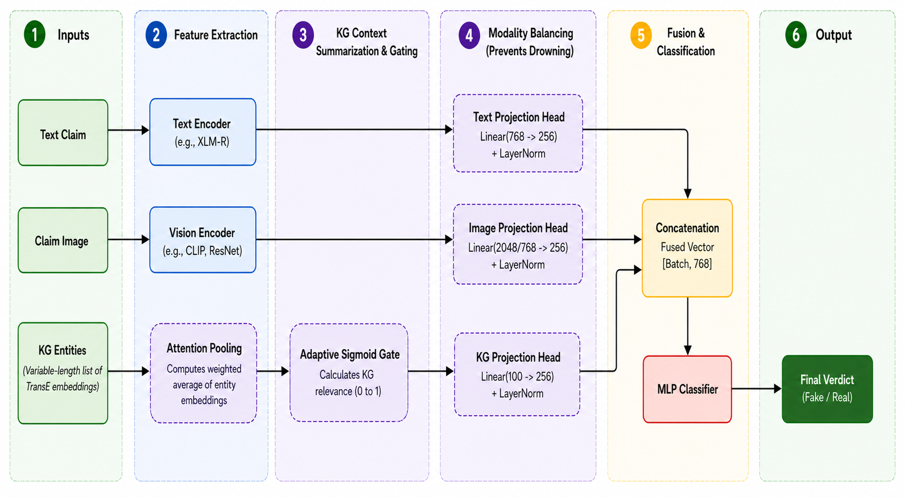

# FactCheck-KG : Multimodal Fake News Detection with Gated Knowledge Graph Fusion

This project implements an advanced multimodal framework for fake news detection on the PolitiFact dataset. The core innovation is a gated fusion mechanism that adaptively integrates textual content, visual information, and external factual knowledge from the Wikidata Knowledge Graph.

---

## Architecture

The system utilizes high-performance encoders (CLIP, ResNet50, MuRIL, XLM-R, mBERT) and fuses them with TransE knowledge graph embeddings. A learnable gating mechanism determines the weight of the Knowledge Graph (KG) entities based on the context of the news article.



---

## Requirements

This project requires **Python 3.10.14** for full compatibility with the mGENRE entity linking model.

### Install Dependencies

```bash
pip install -r requirements.txt
```

### Download spaCy Model

```bash
python -m spacy download en_core_web_sm
```

## Entity Linking Model (mGENRE) Setup

To perform entity disambiguation, install the required libraries from source and download the pre-trained model weights.

### Install Dependencies

```bash
pip install git+https://github.com/facebookresearch/fairseq.git

pip install git+https://github.com/facebookresearch/GENRE.git
```

### Download Pre-trained Weights

```bash
wget https://dl.fbaipublicfiles.com/GENRE/fairseq_multilingual_entity_disambiguation.tar.gz

tar -xvzf fairseq_multilingual_entity_disambiguation.tar.gz
```

### Useful Links

- [fairseq Repository](https://github.com/facebookresearch/fairseq)
- [GENRE Repository](https://github.com/facebookresearch/GENRE)
- [mGENRE Pre-trained Model](https://dl.fbaipublicfiles.com/GENRE/fairseq_multilingual_entity_disambiguation.tar.gz)
---

## Data Organization

The project uses news from FakeNewsNet. Pipeline uses the URL's in the input data files to scrape images.

### Dataset Structure

```text
data/
└── politifact/
    ├── fake/
    │   └── politifact_fake.csv
    └── real/
        └── politifact_real.csv
```

## Knowledge Graph Embeddings

The pre-trained **TransE embeddings** must be downloaded from the **OpenKE** platform (specifically the Wikidata20M embeddings). This repository provides the scripts required to align these embeddings with the news dataset but does not include the binary vector files.

Once downloaded, ensure the Wikidata files are stored exactly as follows to maintain compatibility with the processing scripts:

```text
data/
└── wikidata/
    ├── knowledge_graphs/
    │   └── entity2id.txt
    └── embeddings/
        └── dimension_100/
            └── transe/
                └── entity2vec.bin
```

---

# Execution Pipeline

Run the scripts in the following order from the project root directory.

---

## Phase 1: Preparation

### 1. Scrape Images

Retrieve news images from the source URLs.

```bash
python src/data_processing/download/download_politifact_images.py
```

### 2. Sync Metadata

Align scraped images with CSV records.

```bash
python src/data_processing/preparation/sync_politifact_metadata.py
```

### 3. Create Splits

Generate 80/10/10 Train, Validation, and Test sets.

```bash
python src/data_processing/preparation/create_politifact_splits.py
```

### 4. Generate Master IDs

Generate unique identifier lists for feature alignment.

```bash
python src/data_processing/preparation/generate_politifact_master_ids.py
```

---

## Phase 2: Feature Extraction

### 1. Image Captioning

Generate image descriptions using Qwen/Qwen3-VL-8B-Instruct.

```bash
python src/data_processing/captioning/generate_politifact_image_captions.py
```

### 2. Entity Extraction

Identify named entities in text and images.

```bash
python src/data_processing/entities/extract_text_entities.py

python src/data_processing/entities/extract_image_entities.py

python src/data_processing/entities/clean_image_entities.py
```

### 3. Embedding Generation

Produce visual and textual feature vectors.

```bash
python src/data_processing/embeddings/generate_image_embeddings.py

python src/data_processing/embeddings/generate_text_embeddings.py
```

---

## Phase 3: Knowledge Graph Mapping

### 1. QID Mapping

Link entities to Wikidata QIDs using mGENRE.

```bash
python src/data_processing/qids/map_entities_to_qids.py
```

### 2. QID Aggregation

Extract unique entities for subgraph alignment.

```bash
python src/data_processing/qids/extract_unique_qids.py
```

### 3. TransE Embedding Alignment

Align pre-trained Wikidata vectors with dataset splits.

```bash
python src/data_processing/embeddings/generate_transe_embeddings.py
```

---

# Training and Evaluation

All training and evaluation scripts are located in:

```text
src/training/
```

These scripts handle hyperparameter sweeps across different dropout rates (0.3–0.7) and model combinations.

---

## Baseline Models (Text + Image)

Located in:

```text
src/training/baselines/
```

Examples:

- `evaltrain_clip.py`
- `evaltrain_resnet.py`

These models evaluate performance **without** Knowledge Graph integration.

---

## Proposed Model (Text + Image + KG)

Located in:

```text
src/training/gated_fusion/
```

Examples:

- `evaltrain_gated_clip.py`
- `evaltrain_gated_resnet.py`

These models evaluate the complete gated fusion architecture with Knowledge Graph embeddings.

### Example Command

```bash
python src/training/gated_fusion/evaltrain_gated_clip.py
```

---

# Results

## State-of-the-Art Comparison

| Method | Category | Accuracy (%) |
|---|---|---|
| SpotFake | Multimodal | 77.0 |
| EANN | Multimodal | 80.4 |
| MVAE | Multimodal | 81.2 |
| CompNet | Knowledge-Enhanced | 83.0 |
| CAFE | Multimodal | 84.8 |
| **Ours** | **Multimodal + KG** | **85.98** |

---

## Detailed Performance Breakdown

| Model Combination | Type | Accuracy (%) | F1 Score (%) | Precision (%) | Recall (%) |
|---|---|---|---|---|---|
| CLIP + MuRIL | Multimodal | 84.11 | 82.33 | 88.02 | 81.02 |
| **CLIP + MuRIL + TransE** | **Multimodal + KG** | **85.98** | **84.34** | **88.14** | **83.46** |
| CLIP + mBERT | Multimodal | 79.44 | 78.25 | 79.33 | 77.74 |
| CLIP + mBERT + TransE | Multimodal + KG | 80.37 | 79.14 | 80.54 | 78.54 |
| CLIP + XLM-R | Multimodal | 85.00 | 84.10 | 87.38 | 83.20 |
| **CLIP + XLM-R + TransE** | **Multimodal + KG** | **85.98** | **84.79** | **88.19** | **83.64** |
| ResNet50 + MuRIL | Multimodal | 60.75 | 43.60 | 67.60 | 52.62 |
| ResNet50 + MuRIL + TransE | Multimodal + KG | 82.24 | 81.13 | 82.61 | 80.47 |
| ResNet50 + mBERT | Multimodal | 82.24 | 81.13 | 82.61 | 80.47 |
| ResNet50 + mBERT + TransE | Multimodal + KG | 83.18 | 82.03 | 83.90 | 81.26 |
| ResNet50 + XLM-R | Multimodal | 83.18 | 81.84 | 84.53 | 80.92 |
| **ResNet50 + XLM-R + TransE** | **Multimodal + KG** | **85.05** | **83.86** | **86.68** | **82.85** |

---

# Citations

```bibtex
@inproceedings{han2018openke,
   title={OpenKE: An Open Toolkit for Knowledge Embedding},
   author={Han, Xu and Cao, Shulin and Lv Xin and Lin, Yankai and Liu, Zhiyuan and Sun, Maosong and Li, Juanzi},
   booktitle={Proceedings of EMNLP},
   year={2018}
}

@article{shu2018fakenewsnet,
  title={FakeNewsNet: A Data Repository with News Content, Social Context and Dynamic Information for Studying Fake News on Social Media},
  author={Shu, Kai and Mahudeswaran, Deepak and Wang, Suhang and Lee, Dongwon and Liu, Huan},
  journal={arXiv preprint arXiv:1809.01286},
  year={2018}
}

@article{shu2017fake,
  title={Fake News Detection on Social Media: A Data Mining Perspective},
  author={Shu, Kai and Sliva, Amy and Wang, Suhang and Tang, Jiliang and Liu, Huan},
  journal={ACM SIGKDD Explorations Newsletter},
  volume={19},
  number={1},
  pages={22--36},
  year={2017},
  publisher={ACM}
}

@article{shu2017exploiting,
  title={Exploiting Tri-Relationship for Fake News Detection},
  author={Shu, Kai and Wang, Suhang and Liu, Huan},
  journal={arXiv preprint arXiv:1712.07709},
  year={2017}
}
```
